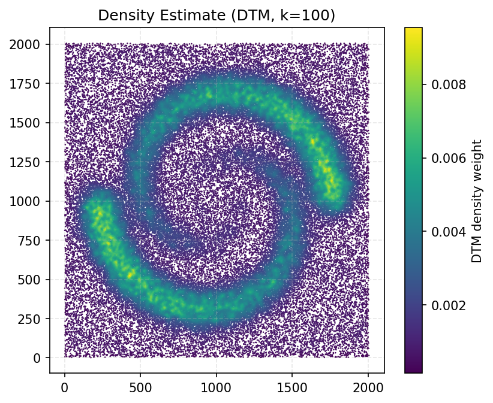
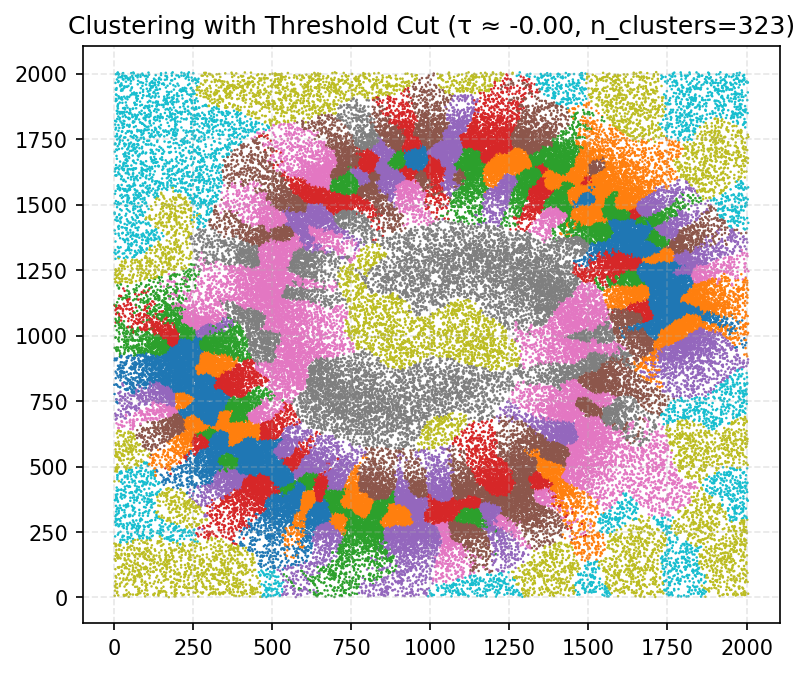

<!-- _class: title-slide -->
# ToMATo in TDA

- Frederic Chazal, Leonidas J. Guibas, Steve Y. Oudot, and Primoz Skraba.
Persistence-Based Clustering in Riemannian Manifolds. J. ACM, 60(6):1–38,
November 2013.

## 
**Jacob Miller**
Department of Mathematics
University of Iowa

---
# Background:

Clustering Algorithms we've seen:
- K-Means
- Spectral Clustering
- DBSCAN
- Agglomerative Clustering

---

# Review of Spectral Clustering:

## Motivation:
- Traditional clustering (e.g., k-means) assumes convex clusters.  
- Real-world data often forms **non-convex manifolds**.  
- *Example*: Concentric Circles
    - k-means fails, but density-based and spectral clustering can handle it.

---
# Spectral Clustering
## Idea:

1. Represent the data as a graph:
   - Nodes = points  
   - Edges = similarity between points (e.g., Gaussian kernel, k-nearest neighbor, $\epsilon$-radius)  

2. Build a **graph Laplacian** $L = D - W$
   - $W$: adjacency matrix
   - $D$: degree matrix, diagonal with $D_{ii} = \sum_j W_{ij}$

---

## Graph Laplacian Properties

- The Laplacian encodes **connectivity structure**.  
- $L$ decomposes as a block-diagonal matrix with a block for each connected component
    - each block has eigenvalue 0 with multiplicity 1 
    - Since this is an approximation of $L$ we look for a spectral gap to find $k$, the 
    multiplicity of eigenvalue 0.

---
## Example

---

## Why Eigendecomposition?

- We project the data into the space spanned by the first $k$ eigenvectors.  
  - Points strongly connected in the graph are mapped close together.  
  - Non-convex clusters become linearly separable in this new space.  

- Finally: apply standard k-means in the embedded space.  

---

# Issues

- **Spectral gap heuristic**:  
  Looks for a large jump in eigenvalues to estimate the number of clusters.  
  - Outliers may blur the spectral gap.  

- **Scalability**:  
  Eigendecomposition becomes expensive

---

# Review of Density-based:

## Assumption:

- Data points are drawn from some **unknown density** $f(x)$.  
    - Clustering = understanding the structure of $f$.

---

# Density Thresholding

- Fix a threshold $\alpha$.  
- Define the **superlevel set**:

$$
F^\alpha = f^{-1}([\alpha, +\infty))
$$

- Connected components of $F^\alpha$ → clusters.  
- Points outside → treated as noise.

Think: DBSCAN

---

## Problems

- Fixed threshold $\alpha$:  
  - Struggles with multi-scale structures.  
  - Different densities in sub-clusters can also be missed.  

---

# Mode-Seeking Clustering:

## Idea

- Detect **local peaks** of the density function $f(x)$.  
- Use peaks as **cluster centers**.  
    - Each data point $\to$ assigned to the basin of attraction of a peak.  

$$
B_p = \{ x \;|\; \text{hill-climb from } x \text{ leads to peak } p \}
$$

---

## Recap:
  - Density thresholding via $F^\alpha$ finds *high-density regions*.  
  - Mode-seeking instead finds *density peaks*.  

---

## Issues

- Gradients and density maxima are **unstable** in high-dim / sparse data.  
- Mode-seeking depends heavily on density estimator.  
    - **Mean-Shift** (Comaniciu & Meer 2002): smooths the estimator before hill-climbing.  
        - Too little smoothing $\to$ noise, too many noisy peaks.  
        - Too much smoothing $\to$ loses meaningful clusters.  

---

# Topological Persistence in Clustering  
*(ToMATo: Topological Mode Analysis Tool)*

---

# Motivation

Is a combination of the following:

- **Mode-seeking (e.g. Mean-Shift):**  
  Finds peaks of a density function $f(x)$ but is **unstable** due to noise in $f$.

- **Spectral methods:**  
  Use eigen-gaps to estimate number of clusters.  

---

# **Problem:** 
How to decide which peaks/clusters are *real* and which are *noise*?  

---
# The Answer:
## Topological Persistence

- Track the **superlevel sets** of $f$:

$$
F^\alpha = f^{-1}([\alpha, +\infty))
$$  

as $\alpha$ decreases from $+\infty$ to $-\infty$.  

- A cluster (component) **is born** when $\alpha$ reaches the height of a peak $p$.
- It **dies** when merged into a component of a higher peak.  

- **Prominence of a peak = (height at birth) – (level at death).**

---

# Persistence Diagram (PD)

- Each cluster’s lifespan plotted as:

  - $x =$ birth level  
  - $y =$ death level  

- Distance to diagonal $y = x$ = **persistence**.  
- Prominent clusters = points far from diagonal.  
- Small, unstable clusters = near diagonal (treated as noise).  

---

# ToMATo Algorithm

1. Run graph-based hill-climbing (as in mode-seeking).  
2. Compute persistence diagram of $\tilde{f}$ (estimated density).  
3. Choose threshold $\tau$:  
   - Merge clusters with persistence $< \tau$ into their parent.  

---

# Relationships of ToMATo with Other Methods

- **Mode-seeking:** ToMATo still looks for peaks, but uses persistence to filter out unstable ones.  
- **Density-based:** instead of a fixed $\alpha$, ToMATo uses persistence adaptively selects significant density modes.  
- **Spectral:** both link parameter choices to *number of clusters*. Spectral gap vs Persisistence.

---

# Implemenation

Input: manifold $X$ with smooth Morse function $f \colon X \to \mathbb{R}$.  
- Gradient flow partitions $X$ into **ascending regions** $A(m)$, each rooted at a critical point (local max).  
- These ascending regions cover $X$ (up to measure zero).  

Use ascending regions of peaks to define **regions of influence** (= clusters).

---

# Persistence in Superlevel-Sets

- *Superlevel Sets*:  
  $$
  F^\alpha = f^{-1}([\alpha, +\infty))
  $$

- As $\alpha$ decreases:  
  - new components **born** when a peak $m_p$ enters $F^\alpha$ ($\alpha = f(m_p)$),  
  - components **die** when merging into higher peak’s component.  

---

# Persistence in Superlevel-Sets

- Prominence of peak $m_p$:  
  $$
  \text{Prom}(m_p) = f(m_p) - d(m_p)
  $$

---

# Persistence Diagram for Connected Components ($H_0$)

- Each peak $\; m_p \;$ represented as point $(x,y)$:  
  - $x =$ birth = peak height $f(m_p)$  
  - $y =$ death = merge level $d(m_p)$  

- Vertical distance to diagonal $y=x$ = **persistence**.  
- Peaks with small persistence = noise.  

---

---

---

---

---

---

# Thresholding with $\tau$

- Fix $\tau \ge 0$ 
    - keep only peaks with prominence $\ge \tau$.  
- For any peak $m_q$, iteratively map roots to more prominent peaks until one with prominence $\ge \tau$.  
- Define **basin of attraction**:  

$$
B_\tau(m_p) = \bigcup_{r^*_\tau(m_q) = m_p} A(m_q)
$$

- Clusters = basins of $\tau$-significant peaks.  

---

# Discrete Setting (Graph)

- Input graph $G$:  
  - vertices = data points  
  - edges = neighborhood connections  
  - $\tilde f(i) =$ density estimate at vertex $i$  

- Parameters: graph $G$, density $\tilde f$, merge parameter $\tau$.  

---

# Step 1: Mode-Seeking

- Process vertices in decreasing $\tilde f$ order.  
- For vertex $i$:  
  - If a neighbor $j$ has $\tilde f(j) > \tilde f(i)$ → connect $i \to j$ (pseudo-gradient).  
  - If no higher neighbor → $i$ is a **peak**.  

 
*Result*: a spanning forest
- each tree $\approx$ ascending region of a peak.

---

# Step 2: Merging with $\tau$

- Use Union-Find (disjoint sets).  
- For each vertex $i$:  
  - If $i$ is a peak → start new entry.  
  - Else → belongs to existing tree entry.  

- Check if neighboring entries should merge:  
  $$
  \min\{\tilde f(r(e)), \tilde f(r(e_i))\} < \tilde f(i) + \tau
  $$  
  If yes → merge (lower peak merges into higher one).

---

# Output

- Clusters = entries whose root peak has $\tilde f(r(e)) \ge \tau$.  
- Points in clusters with lower roots = treated as noise.  
- Persistence diagram arises naturally from birth/death of entries.  

---

# Complexity

- Sorting vertices: $O(n \log n)$  
- Mode-seeking: $O(n + m)$  
- Union-Find merges: $O(n + m \alpha(n))$  
  ($\alpha$ = inverse Ackermann function).  
- Memory: $O(n)$ active, $O(n+m)$ total (graph).  

---

# Parameter Choices

- **Graph $G$:**  
  - $\delta$-Rips or kNN (metric-based, scale chosen by $\delta$ or $k$)  
  - Delaunay (parameter-free, may create long edges)  

- **Density $\tilde f$:**  
  - Kernel estimators, or distance-to-measure method.  

- **Merge parameter $\tau$:**  
  - First run with $\tau=+\infty$ → compute PD.  
  - Inspect PD → choose $\tau$ based on prominence gap.  
  - Second run with chosen $\tau$ → final clusters.  

---

# Theoretical Guarantees of ToMATo

---

# Setup

Given:

- Space: 
    - $X$ = $m$-dimensional Riemannian manifold.  
    - Positive Convexity Radius
- Density:
    - $f : X \to \mathbb{R}$ Lipschitz-continuous 
    - sampled i.i.d.
- Graph: 
    - $\delta$-Rips graph $G$ on point cloud $P$.  

---

# Separation Condition

**Definition:** $D^0_f$ is $(d_1, d_2)$-separated if every point lies either:  
- above $y = x - d_1$ (*noise region $D_1$*), or  
- below $y = x - d_2$, $x \ge d_2$ (*signal region $D_2$*).  

**Interpretation:**  
- $d_2 - d_1 =$ **prominence gap**
- The larger the gap, the more stable clusters.  

---

# Result 1: Correct Number of Clusters

**Theorem 9.2 (informal):**  
If $D^0_f$ is $(d_1,d_2)$-separated and $\delta$ is sufficiently small,  
then there exists a range of $\tau$:  

$$
\tau \in [\, d_1 + O(\delta)\,,\, d_2 - O(\delta) \,]
$$  

such that **ToMATo outputs the correct number of clusters**  
with probability at least $1 - e^{-\Omega(n)}$.  

- Larger gap $d_2 - d_1$ → wider valid $\tau$ range.  
- Smaller $\delta$ → better approximation.  

---

# Result 2: Approximation of Basins

**Theorem 10.1 (informal):**

- For each prominent peak $m_p$ of $f$:  
  ToMATo outputs a cluster $C$ that coincides (over $P$)  
  with the basin of attraction $B_\tau(m_p)$ down to level
  $$
  \alpha \in [\, \alpha_\tau(m_p)+d_1+O(\delta), \, f(m_p) \,)
  $$  

- Below this range, basins may become unstable.  

Top parts of basins are **stable under perturbations**,  
so the algorithm captures the reliable parts of clusters.  

---

# Example: 

---

# Density Estimate:

---

# First run:

---

# Result:

---

# Threshold:

---

---

# Thank You 
### GUDHI ToMATo Implementation  
[https://gudhi.inria.fr/python/latest/clustering.html](https://gudhi.inria.fr/python/latest/clustering.html)
