<!-- _class: title-slide -->

# An Introduction to Clustering
##
**Jacob Miller**  
Department of Mathematics  
University of Iowa  

---

## Outline:

- What is Clustering?
- Theory
- Types of Clusters
- Some Clustering Algorithms
- Clustering Evaluation

---

## What is Clustering?

Partitioning a dataset where points within each group are more *similar* to each other than to points in other groups.

**Formally**: Given dataset $X = \{x_1, x_2, \ldots, x_n\} \subset \mathbb{R}^d$, find partition $\mathcal{C} = \{C_1, C_2, \ldots, C_k\}$ where $\bigcup_{i=1}^k C_i = X$ and $C_i \cap C_j = \emptyset$ for $i \neq j$.

**Unsupervised**: No ground truth labels to check clustering against.

---

## Visual Example of Clustering

**Intuition**: Clusters are dense subsets separated by sparse subsets.

---

## What is 'Similar'?

- **Partitional Style**: Views clustering as an optimization problem on partitions.

Given data points $X = \{x_1, \ldots, x_n\}$, find a partition $\{C_1, \ldots, C_K\}$ that (min)maximizes some (dis)similarity score (between) within clusters.

- **Hierarchical Style**: Creates a binary tree where splits at different levels obtains different clustering solutions without rerunning clustering.

---

## Optimization Examples
$$\min_{\mathcal{C} \in \mathcal{Part}(X)} \sum_{k=1}^{|\mathcal{C}|} \sum_{x_i, x_j \in C_k} d(x_i, x_j)$$

$$\max_{\mathcal{C} \in \mathcal{Part}(X)} \sum_{k=1}^{|\mathcal{C}|} \sum_{x_i, x_j \in C_k} \text{sim}(x_i, x_j)$$

---

## Distance Example

$$\min_{\mathcal{C}} \sum_{k=1}^{|\mathcal{C}|} \sum_{x_i \in C_k} d(x_i, \mu_k)$$

Where $\mu_k$ is a representative for cluster $C_k$

- Euclidean: $d(x_i, x_j) = \|x_i - x_j\|_2 = \sqrt{\sum_{d=1}^{D}(x_{id} - x_{jd})^2}$
- Manhattan: $d(x_i, x_j) = \|x_i - x_j\|_1 = \sum_{d=1}^{D}|x_{id} - x_{jd}|$
- Cosine: $d(x_i, x_j) = 1 - \frac{x_i \cdot x_j}{\|x_i\|_2\|x_j\|_2}$

---

## What would you want?

- **Scale-invariance**: $f(\alpha \cdot X) = f(X)$ for $\alpha > 0$
- **Richness**: For any partition of $X$, there exists a distance function such that the clustering function returns that partition
- **Consistency**: Shrinking intra-cluster distances and expanding inter-cluster distances doesn't change the clustering

---

## Impossibility Theorem

- **Scale-invariance**: $f(\alpha \cdot X) = f(X)$ for $\alpha > 0$
- **Richness**: For any partition of $X$, there exists a distance function such that the clustering function returns that partition
- **Consistency**: Shrinking intra-cluster distances and expanding inter-cluster distances doesn't change the clustering

**Kleinberg's Impossibility Theorem**: There is no clustering scheme that satisfies all three properties simultaneously.

---

## Types of Clusters

The choice of distance criterion and algorithm determines cluster shapes:

---

## Spherical/Convex
Circular or elliptical boundaries
- **Assumption**: $d(x, \mu) \leq r$ for cluster center $\mu$ and radius $r$
- Example: K-means produces spherical clusters with $L_2$ norm

---

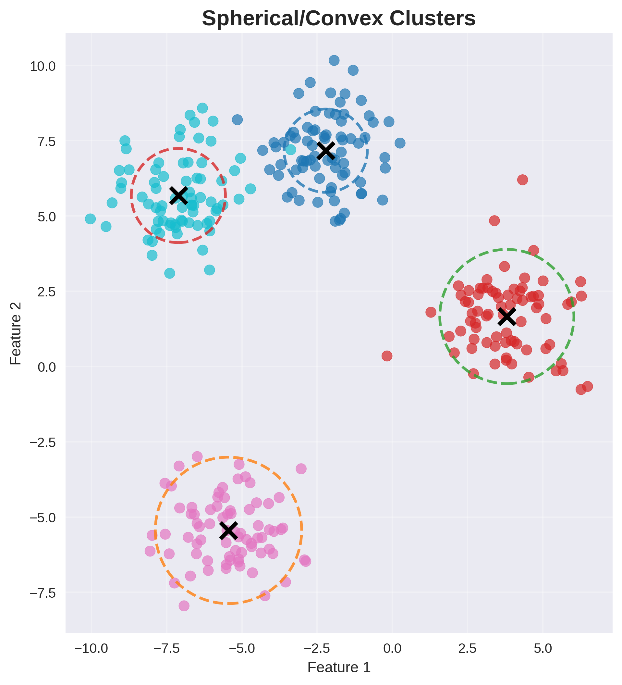

---

## Manifold/Non-Convex 
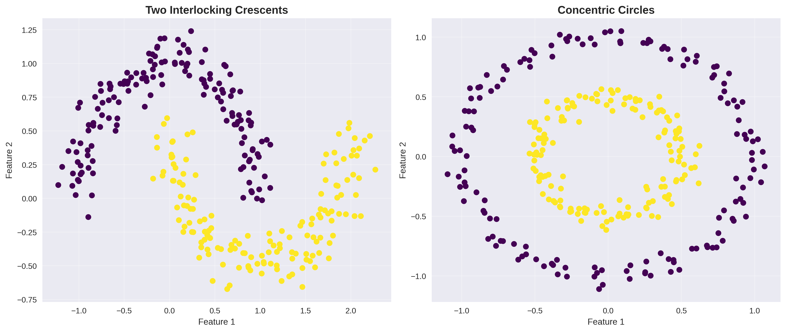

---

## Varying vs. Uniform Density
- **Uniform**: $\rho(C_i) \approx \rho(C_j)$ for all clusters $i, j$
- **Varying**: $\frac{|C_i|/\text{vol}(C_i)}{|C_j|/\text{vol}(C_j)} \gg 1$ for some clusters

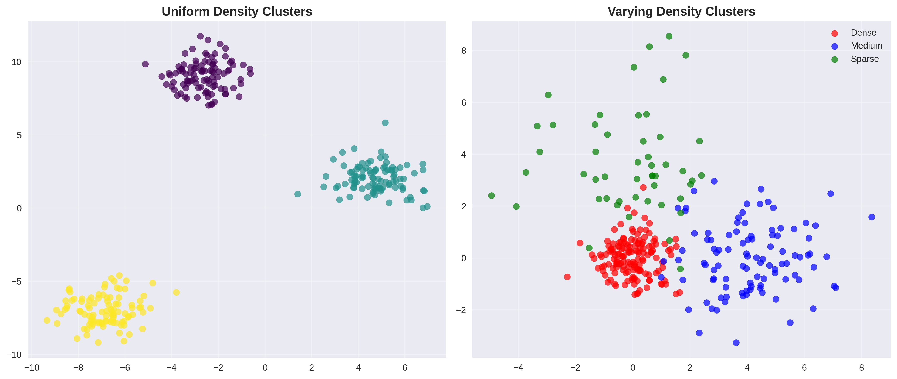

---

## Well-separated vs. Connected:
- **Separated**: $\min_{x \in C_i, y \in C_j} d(x,y) > \max_{x,y \in C_k} d(x,y)$ for $k \in \{i,j\}$
- **Connected**: Clusters connected by low-density regions

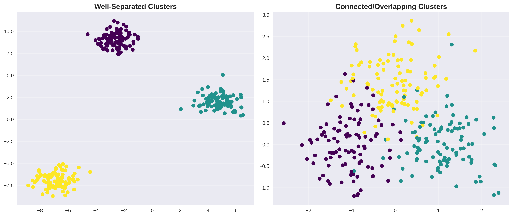

---

## Types of Clustering Algorithms

**Four main categories**:

1. **Partitioning**: Minimize $\sum_{k} \sum_{x \in C_k} d(x, \mu_k)^2$
2. **Hierarchical**: Build tree with linkage $d(C_i, C_j)$
3. **Density-based**: Find $\{x : \rho(x) > \theta\}$ for density $\rho$
4. **Model-based**: Maximize $\prod_{i} \sum_{k} \pi_k p(x_i | \theta_k)$

Each has different assumptions about cluster structure!

---

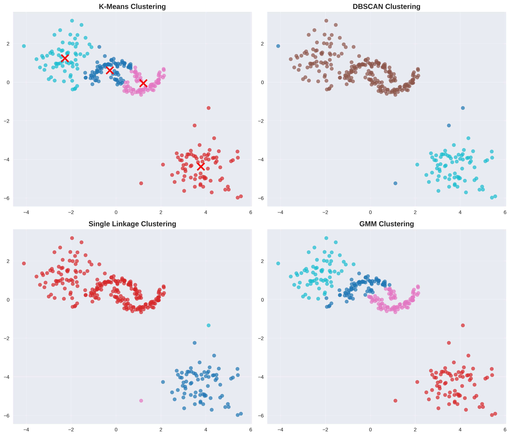

---

## Partitioning (distance) Methods: K-Means

**Algorithm**:
1. Initialize K cluster centroids $\mu_1^{(0)}, \ldots, \mu_K^{(0)}$ randomly
2. Assign: $C_k^{(t)} = \{x_i : k = \arg\min_j \|x_i - \mu_j^{(t-1)}\|^2\}$
3. Update: $\mu_k^{(t)} = \frac{1}{|C_k^{(t)}|} \sum_{x_i \in C_k^{(t)}} x_i$
4. Repeat steps 2-3 until $\|\mu_k^{(t)} - \mu_k^{(t-1)}\| < \epsilon$, or $t$ reaches some threshold.

---

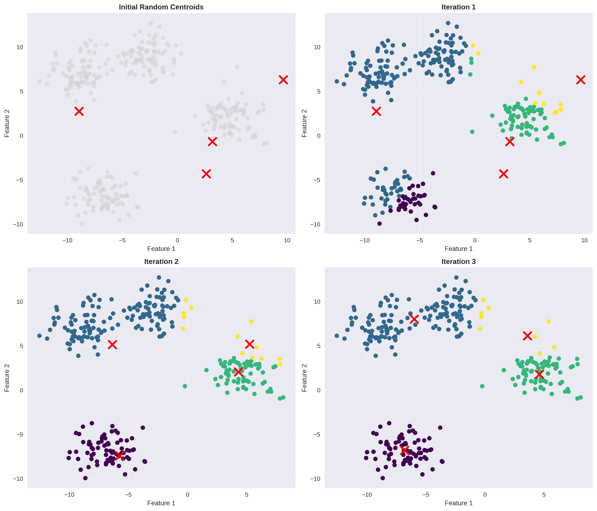

---

## K-Means:
- K-Means is effectively minimizing the Sum-Square Error (SSE)
- SSE monotonically decreases with each iteration
    - eventually converges to a local minimum.

### Factors:
- Choosing the initial centroids
- Estimating the number of clusters

---
## K-Modes Clustering:
A similar approach to K-Means but for categorical data.

1. Select $K$ initial modes.
2. Form $K$ clusters by assigning data-points to the cluster with the nearest mode using matching metric $(L_0)$.
3. Recompute modes for each clusters.
4. repeat 2-3 until convergence criterion is met.

- Note: still only local optimal solutions.

---

## Hierarchical Clustering
Attempts to handle issues with partitional clustering.
1. **Agglomerative** (bottom-up): Start with $n$ clusters $\{x_i\}$, merge until $k$ clusters
2. **Divisive** (top-down): Start with 1 cluster $X$, split until $k$ clusters

**Output**: Dendrogram showing cluster hierarchy at all levels

- Allows for cutting the hierachy at any given level instead of prespecifying the number of clusters.

---

## Dendrogram

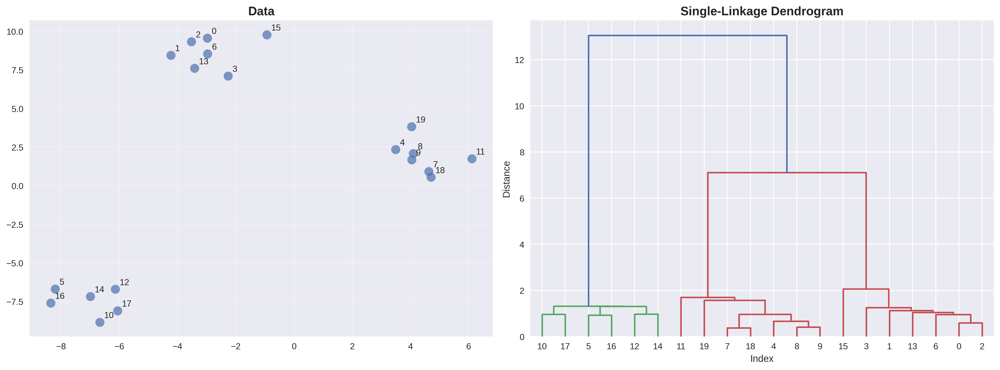

---

## Agglomerative Clustering Steps:
1. Initialize each point as a cluster.
2. A dissimilarity matrix is constructed between all clusters.
3. Closest sets of clusters are merged at each level and the dissimilarity matrix is updated.
4. Repeat until converge to a final maximal cluster.

---

## Some Linkage Criteria

**Single linkage**: Distance between closest points (NN)

**Complete linkage**: Distance between farthest points (Diameter)

**Average linkage**: Average distance between all pairs (average link)

**Ward's Linkage**: Uses K-Means squared error criterion weighted by cardinalities
- Minimal variance when merging clusters.

---

## Single-Linkage Clustering

1. **Initialize**: Start with $n$ clusters, each containing one point
   $$\mathcal{C}^{(0)} = \{\{x_1\}, \{x_2\}, \ldots, \{x_n\}\}$$

2. **Compute distance matrix**: Calculate all pairwise cluster distances
   $$D^{(0)}_{ij} = d(x_i, x_j) \text{ for all } i \neq j$$

3. **Find minimum**: Identify closest pair of clusters
   $$(i^*, j^*) = \arg\min_{i,j: i \neq j} D^{(t)}_{ij}$$

---

4. **Merge**: Combine clusters $C_{i^*}$ and $C_{j^*}$
   $$C_{\text{new}} = C_{i^*} \cup C_{j^*}$$

5. **Update distances**: For all remaining clusters $C_k$:
   $$D_{\text{new},k} = \min(D_{i^*,k}, D_{j^*,k})$$

6. **Repeat**: Until desired number of clusters or single cluster remains

---

## Single-Linkage

**Note**: Creates elongated clusters due to **chaining effect** 
- clusters connected by single close points will merge.

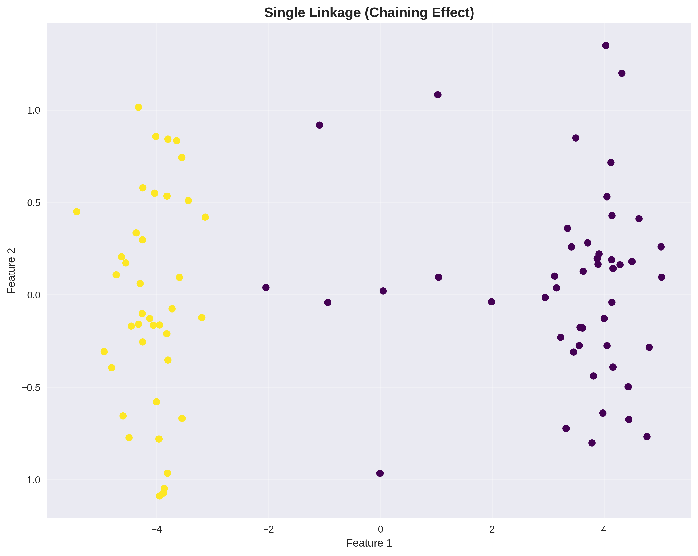

---

## Density-Based Clustering

- Clusters are dense regions separated by sparse regions

- Allows for clusters of arbitrary shape

**Factors**:
- How is density estimated?
- How is connectivity defined?

**Examples**: DBSCAN, DENCLUE, OPTICS

---
## DBSCAN

- **Core point**: $\rho_{\epsilon}(x) \geq \text{minPts}$
- **Border point**: $\rho_{\epsilon}(x) < \text{minPts}$ but $\exists$ core point $y$ with $d(x,y) \leq \epsilon$
- **Noise point**: Neither core nor border

**Density-reachable**: $x$ is density-reachable from $y$ if $\exists$ chain of core points connecting them.

---

## DBSCAN Algorithm

1. For each point $p$:
   - Find $N_{\epsilon}(p) = \{q \in X : d(p,q) \leq \epsilon\}$
   - If $|N_{\epsilon}(p)| \geq \text{minPts}$, mark as core point

2. For each core point $p$:
   - Create cluster $C = \{p\} \cup \{q : q \text{ density-reachable from } p\}$

3. Assign border points to nearby clusters

4. Mark remaining points as noise

---

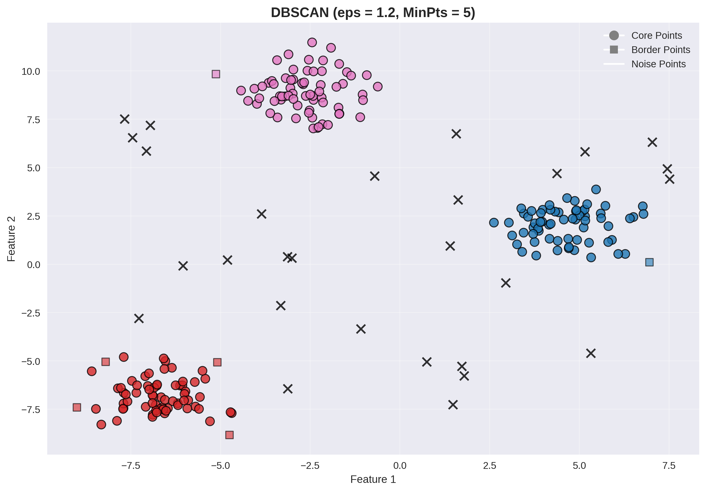

---

## Probabilistic model-based

Optimize the fit between observed data and some model using a probabilistic approach

$$ \text{ Clustering } \rightarrow \text{ Parameter Estimation }$$

---

## Probabilistic Overview:
Suppose the dataset $X$ consists of $N$ observations from a random variable $\mathbf{x}$ distributed via a mixture of $K$ components (clusters)

The mixture distribution (pdf) of $x_n$ can be written as 

$$ p(x_n) = \sum_{k=1}^{K} \pi_{k}p(x_n | \theta_k)$$

Where $\pi_k$ are the mixing weights (sum to 1) and $\theta_k$ is the set of parameters for the $k^{\text{th}}$ component.

---
By Bayes' theorem we get:
$$ p(z_{nk} = 1 | x_n) = \frac{\pi_k p(x_n | \theta_k)}{\sum_{j=1}^{K} \pi_{j}p(x_n | \theta_j )}$$
where $z_{nk}$ is the membership of $x_n$ in cluster $k$

---

## Maximum Likelihood Estimation: 

Considers the best estimate of parameters as one that maximizes probability of generating all observations:
$$ \log p(\mathbf{X}| \mathbf{\Theta}) = \sum_{n=1}^{N}\log \sum_{k=1}^{K} \pi_k p(x_n | \theta_k)$$

$$ \Theta_{\text{ML}} = \text{arg max}_{\Theta} \left\{ \log p(\mathbf{X} | \mathbf{\Theta})\right\} $$

---

## EM alternates between:

**E-step**: Compute posterior distribution of latent variables

**M-step**: Maximize expected complete log-likelihood

---

## Gaussian Mixture Models (GMM)

**Assumption**: Data generated from $K$ Gaussian distributions

$$p(x) = \sum_{k=1}^{K} \pi_k \mathcal{N}(x| \mu_k, \Sigma_k)$$

where 
$$\mathcal{N}(x| \mu, \Sigma) = \frac{1}{(2\pi)^{d/2}|\Sigma|^{1/2}} \exp\left(-\frac{1}{2}(x-\mu)^T\Sigma^{-1}(x-\mu)\right)$$

---

## EM Algorithm for GMM

**E-step**: Compute responsibility of component $k$ for point $i$
$$r_{ik} = \frac{\pi_k \mathcal{N}(x_i; \mu_k, \Sigma_k)}{\sum_{j=1}^{K} \pi_j \mathcal{N}(x_i; \mu_j, \Sigma_j)}$$

**M-step**: Update parameters
$\mu_k = \frac{\sum_{i=1}^{n} r_{ik} x_i}{\sum_{i=1}^{n} r_{ik}}, \quad \pi_k = \frac{1}{n}\sum_{i=1}^{n} r_{ik}$
$\Sigma_k = \frac{\sum_{i=1}^n r_{ik}(x_i - \mu_k)(x_i - \mu_k)^T}{\sum_{i=1}^n r_{ik}}$

---

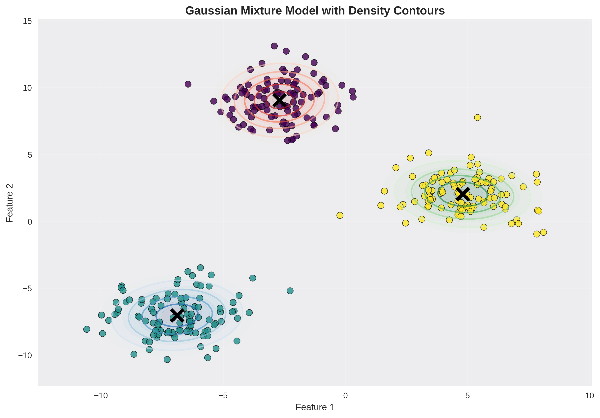

---

## Spectral Clustering

1. Construct a similarity graph for all data points.
2. Data points are embedded in a space where clusters are more obvious (aka Spectral Embedding)
    - uses eigenvectors of the graph Laplacian
3. A classical clustering algorithm like K-Means is applied to partition the embedding

---

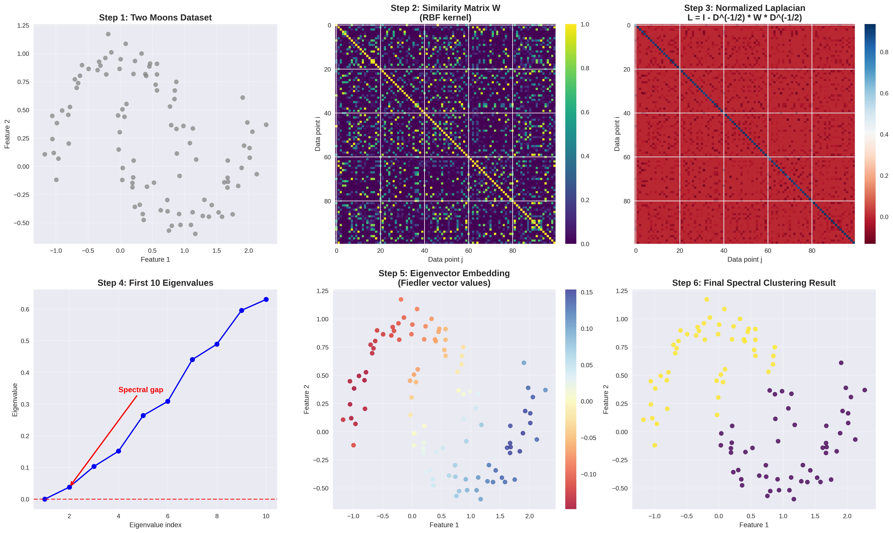

---

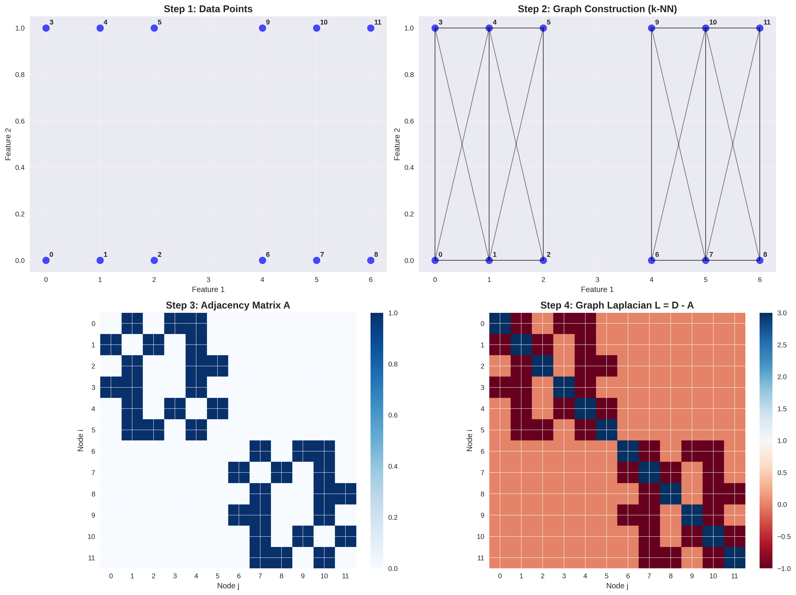

---

## High-Dimensions

**Curse of dimensionality**:
1. Any Global optimization approach increases computation exponentially with dimensions.
2. Concentration effect: distance measure is less effective.
3. More irrelevant attributes (dimensions) in clustering.
4. Correlated attributes are redundant
    - Intrensic dimensionality $<<$ Embedding dimensionality (number of features).

---

## Co-Clustering

**Motivation**: Cluster both rows (samples) and columns (features) simultaneously

**Matrix**: $X \in \mathbb{R}^{n \times d}$ → row clusters $\mathcal{R} = \{R_1, \ldots, R_k\}$, column clusters $\mathcal{C} = \{C_1, \ldots, C_\ell\}$

- **Spectral co-clustering**: SVD of $D_r^{-1/2} X D_c^{-1/2}$
- **Block diagonal**: Minimize $\|X - \sum_{i,j} A_{ij} R_i C_j^T\|_F^2$  
- **Information-theoretic**: Maximize mutual information $I(\mathcal{R}; \mathcal{C})$

---

## Cluster Evaluation

1. **External validation**: Compare against ground truth labels
2. **Internal validation**: Evaluates clustering using the same data
   - Silhouette score, Calinski-Harabasz index, Davies-Bouldin index

---

## Silhouette Score

**For each point $i$**: Compute silhouette coefficient
$$s_i = \frac{b_i - a_i}{\max(a_i, b_i)}$$

where:
- $a_i = \frac{1}{|C(i)|-1} \sum_{j \in C(i), j \neq i} d(i,j)$: avg distance within cluster
- $b_i = \min_{k \neq C(i)} \frac{1}{|C_k|} \sum_{j \in C_k} d(i,j)$: avg distance to nearest cluster

---

## Silhouette Score 

Overall score is given by the average of these coefficients

$$\text{Silhouette} = \frac{1}{n}\sum_{i=1}^{n} s_i \in [-1,1]$$

- $s_i \to 1$ (well-clustered)
- $s_i \to 0$ (boundary) 
- $s_i \to -1$ (misclassified)

---

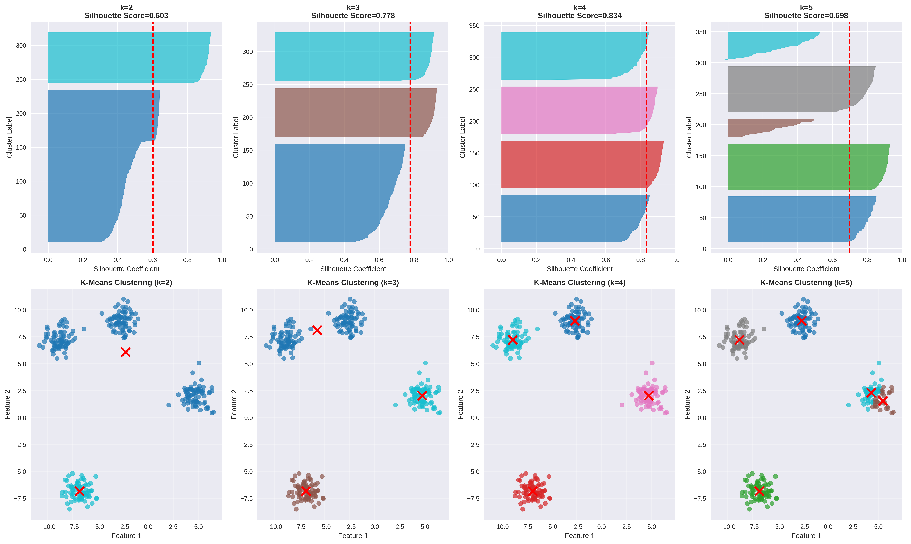

---

# FIN

