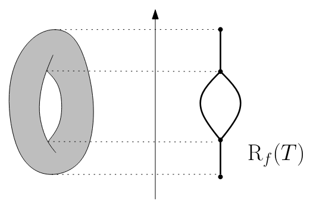

<!-- _class: title-slide -->
# Statistical Analysis and Parameter Selection for Mapper
### Background Talk
[Carrière, Michel & Oudot (2018)](https://hal.science/hal-01633106v2)

**Jacob Miller**  
Department of Mathematics  
University of Iowa

---

# Review: The Reeb Graph

Let $X$ be a topological space and $f : X \to \mathbb{R}$ a continuous function.  
Define an equivalence relation:
$$
x \sim_f x' \iff x, x' \text{ lie in the same connected component of } f^{-1}(y)
$$
for some $y \in \mathrm{Im}(f)$.

The **Reeb graph** $R_f(X)$ is the quotient space $X / \sim_f$.

---

 
---

# Morse-type Functions

A continuous function $f : X \to \mathbb{R}$ on compact $X$ is **Morse-type** if:

1. There is a finite set of critical values $\mathrm{Crit}(f) = \{ a_1 < \dots < a_n \}$  
     - between critical values:
   $$
   f^{-1}((a_i,a_{i+1})) \simeq Y_i \times (a_i,a_{i+1})
   $$
     - with $Y_i$ compact and locally connected.

- There is a homeomorphism $\mu_i: Y_i \times (a_i,a_{i+1}) \to f^{-1}[(a_i,a_{i+1})]$
which acts as a *trivial fibration* with fiber $Y_i$.
    - $f|_{f^{-1}[(a_i,a_{i+1})]} = \pi_2 \circ \mu_{i}^{-1}$

---

# Morse-type Functions (continued...)
In addition to $f$ behaving locally like a trivial fibration we have:

2. Each $\mu_i: Y_i \times (a_i,a_{i+1}) \to X$ extends continuously to 
$$\bar{\mu}_i : Y_i \times [a_i,a_{i+1}] \to X.$$

    So we have level-sets merge and split continuously...

3. Every level set $X_t = f^{-1}(t)$ has finitely generated homology.
    - Finite number of connected components in each level-set.

    - $\implies R_f(X)$ is a finite **multigraph**.

---

# Mapper
### Using Width-balanced cover with neighborhood graph clustering:

- **Resolution** $r$: the length of intervals $\ell(I_s)$  
- **Gain** $g \in (0, 0.5)$: fractional overlap between consecutive intervals  
  $$
  g = \frac{\ell(I_s \cap I_{s+1})}{\ell(I_s)}
  $$
- **Scale** $\delta$: radius parameter of the neighborhood (Rips) graph

We denote this discrete Mapper as:
$$
M_{r,g,\delta}(X_n, f(X_n))
$$

---

# Discrete vs. Continuous Mapper

With complete data the clustering step, $\delta$-Rips, is unnecessary.
- Take connected components directly.

$$
\begin{align*}
    M_{r,g}(X, f) & \quad \text{(continuous Mapper)} \\
    M_{r,g,\delta}(X_n, f(X_n)) & \quad \text{(discrete Mapper)}
\end{align*}
$$

---

# Extended Persistence:

- The family of sublevel sets of a continuous, real-valued function $f$ defines a filtration.
$$
X^{(-\infty, \alpha]} \subseteq X^{(-\infty, \beta]} \quad \alpha \leq \beta \in \mathbb{R}
$$
Similarly the superlevel sets are nested in the reverse direction
$$
X^{[\alpha, \infty)} \supseteq X^{[\beta, \infty)} \quad \alpha \leq \beta \in \mathbb{R}
$$

- Sublevel sets build up $X$ as $\alpha$ increases ("ordinary filtration").
- Superlevel sets shrink $X$ as $\alpha$ increases ("relative filtration").

---
# Extended Persistence (cont...)

Traditionally, persistence studied only the sublevel side.  
- **Extended persistence** joins both into a single unified filtration by connecting the two filtrations* at infinity.
$$ \text{Gives a filtration over } \mathbb{R}_{\text{Ext}} = \mathbb{R} \cup \{+\infty\} \cup \mathbb{R}^{\text{op}}$$

---

# Extended Persistence (cont...)
1. Replace each *superlevel* set, $X^{[\alpha, +\infty)}$ with the *pair* of spaces: 
$$
(X, X^{[\tilde{\alpha}, +\infty)}) , \quad \tilde{\alpha} \in \mathbb{R}^{\text{op}}
$$

This lets us continue past the maximum of $f$, since:
$$
(X, X^{[\tilde{\alpha}, +\infty)}) \subseteq (X, X^{[\tilde{\beta}, +\infty)})
\quad \text{for all }\tilde{\alpha} \le \tilde{\beta}.
$$
These pairs form an *increasing family* just as the sublevel sets do

---

# Extended Persistence (cont...)
2. Define an extended index set:
$$
\mathbb{R}_{\mathrm{Ext}} = 
\mathbb{R} \ \cup\ \{ +\infty \}\ \cup\ \mathbb{R}^{\mathrm{op}}
$$
where $\mathbb{R}^{\mathrm{op}}$ is $\mathbb{R}$ ordered in reverse,  
and we define the total order:
$$
\alpha < +\infty < \tilde{\beta}, \qquad 
\alpha \in \mathbb{R},\ \tilde{\beta} \in \mathbb{R}^{\mathrm{op}}.
$$

- This makes $\mathbb{R}_{\mathrm{Ext}}$ *isomorphic* (order-wise) to $\mathbb{R}$.

---

# The Extended Filtration Definition

The **extended filtration** $\{F_\alpha\}_{\alpha \in \mathbb{R}_{\rm Ext}}$ of $f$ is given by:

$$
F_\alpha =
\begin{cases}
X^{(-\infty, \alpha]} , & \alpha \in \mathbb{R} \\
X \equiv (X, \varnothing), & \alpha = +\infty \\
(X, X^{[\tilde{\alpha}, +\infty)}), & \tilde{\alpha} \in \mathbb{R}^{\mathrm{op}}
\end{cases}
$$
- The **ordinary part**: $\{F_\alpha\}_{\alpha \in \mathbb{R}}$
- The **relative part**: $\{F_{\tilde{\alpha}}\}_{\tilde{\alpha} \in \mathbb{R}^{\mathrm{op}}}$

---

---

# Filtration to Persistence Module

Apply the homology functor $H_*$.  
This yields the **extended persistence module** $V$ of $f$:

$$
V_\alpha = H_*(F_\alpha)
$$

Explicitly:
$$
V_\alpha =
\begin{cases}
H_*(X^{(-\infty,\alpha]}), & \alpha \in \mathbb{R} \\
H_*(X) \cong H_*(X, \emptyset), & \alpha = +\infty \\
H_*(X, X^{[\tilde{\alpha}, +\infty)}), & \tilde{\alpha} \in \mathbb{R}^{\mathrm{op}}.
\end{cases}
$$

Arrows between these spaces come from inclusions $F_\alpha \hookrightarrow F_\beta$.

---

# Decomposition into Interval Modules

For Morse‑type functions, $V$ decomposes as a finite direct sum:
$$
V \cong \bigoplus_{k=1}^n I_{[b_k, d_k)}.
$$

Each **interval module** $I_{[b_k,d_k)}$:
- equals the base field between $b_k$ and $d_k$,
- becomes $0$ outside that interval,  
- represents a *homological feature* (component, loop, void, etc.),
  born at $b_k$ and dying at $d_k$.

---

# 9. The Extended Persistence Diagram $\mathrm{Dg}(f)$

Plot every interval $[b_k, d_k)$ as a point $(b_k, d_k)$ in $\mathbb{R}^2$:  
this gives the **extended persistence diagram.**

| Type  | Birth, Death Range | Interpretation |
|:--|:--|:--|
| Ordinary | both in $\mathbb{R}$ | Born and dies in ordinary filtration |
| Relative | both in $\mathbb{R}^{\mathrm{op}}$ | Born and dies in relative filtration |
| Extended | birth in $\mathbb{R}$, death in $\mathbb{R}^{\mathrm{op}}$ | Persists across both parts |

---

# Diagram Geometry

- **Ordinary points** lie **above** the diagonal $\Delta = \{(x,x)\}$  
- **Relative points** lie **below** $\Delta$  
- **Extended points** may appear *anywhere*, even on $\Delta$

With the full diagram looking like:  
$$
\mathrm{Dg}(f) = \mathrm{Ord}(f) \cup \mathrm{Rel}(f) \cup
\mathrm{Ext}^+(f) \cup \mathrm{Ext}^-(f)
$$

---

# Bottleneck Distance

Given two persistence diagrams $D, D'$:

- Define a **partial matching** $\Gamma \subseteq D \times D'$
  that pairs points of the same type/dimension.

- The **cost** of matching:
  $$
  \text{cost}(\Gamma)
  = \max\left(
  \max_{p \in D} \delta_D(p),
  \max_{p' \in D'} \delta_{D'}(p')
  \right)
  $$
  where $\delta_D(p)$ = distance to match or diagonal.

---

# Bottleneck Distance $d_\Delta$

- The **bottleneck distance:**
  $$
  d_\Delta(D, D') = \inf_{\Gamma} \text{cost}(\Gamma)
  $$

compares persistence diagrams.

---

# Comparing Mapper and Reeb Graphs

Using extended persistence, one could measure how well the Mapper
approximates the Reeb graph:

$$
d_\Delta(R_f(X), M_{r,g,\delta}(X_n, f(X_n)))
= d_\Delta(Dg(R_f(X)), Dg(M_{r,g,\delta}(X_n, f(X_n))))
$$

**Result:** (Carriere, Michel, Oudot)
- As sampling density increases and parameters shrink: Mapper converges statistically to the Reeb graph.

---

# References

- M. Carrière, B. Michel, S. Oudot,  
  *Statistical Analysis and Parameter Selection for Mapper*,  
  JMLR (2018).

- F. Chazal et al., *The Structure and Stability of Persistence Modules*, Springer 2016.

